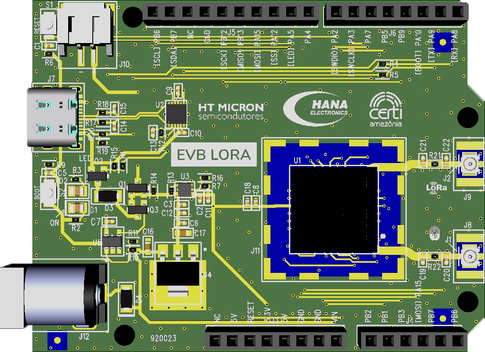

# Evaluation Board - LoRa® e Bluetooth Low Energy®

  

  The EvB LoRa board was developed with the purpose of enabling easy access to the input and output pins of the iMCP-HTLRBL32L-10 component from HT Micron. This component is a System-in-Package (SiP) that has communication capabilities using the LoRa and BLE protocols. The component integrates a BlueNRG SoC microprocessor from ST Microelectronics with Bluetooth LE interface and an RF transceiver from Semtec with a multi-region LoRaWAN interface.o.

## Important links

- [Data Brief](https://github.com/Hana-Electronics/EVB-LoRaWAN-HTLRBL32L/blob/main/docs/datasheets/EvB%20LoRa.pdf)
- [Documentation](https://github.com/Hana-Electronics/EVB-LoRaWAN-HTLRBL32L/tree/main/docs)
- [Examples](https://github.com/Hana-Electronics/EVB-LoRaWAN-HTLRBL32L/tree/main/examples)

## For more informations about iMCP HTLRBL32L-SDK

- [iMCP HTLRBL32L - Data Sheet](https://github.com/htmicron/htlrbl32l/blob/documents/HTLRBL32L-Datasheet/DS002%20Rev.01%20-%20Datasheet%20HTLRBL32L-xx.pdf)
- [iMCP HTLRBL32L - Examples and Docs](https://github.com/htmicron/htlrbl32l/tree/SDK)
- [iMCP HTLRBL32L - GitHub](https://github.com/htmicron/htlrbl32l)

## Having difficults?

- [Training Course](https://hanaelectronics.com.br/capacitacao/)

## SDK

The SDK is available in its own [repository](https://github.com/Hana-Electronics/HE-HTLRBL32L-SDK). Please check it for updated versions, changelogs, and release notes.

## Contact

Register your interest in iMCP - HTLRBL32L in the form: https://forms.office.com/r/nvTXCTS5je

If you have any questions, please submit a ticket in the [IoT Support section](https://htmicron.com.br/contato/).

