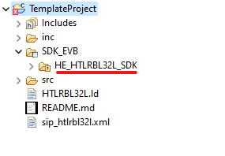
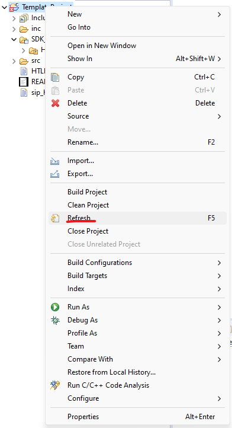
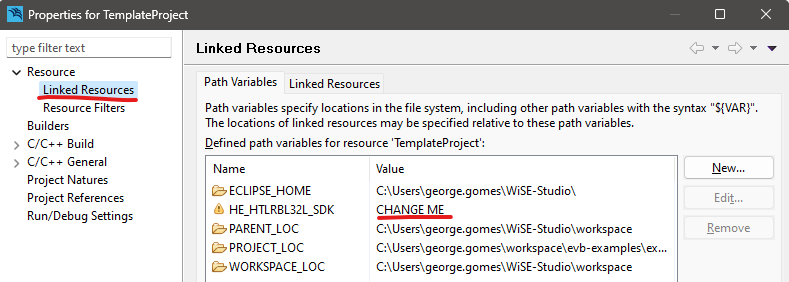

## [1.1.3] - 2023-12-12

- Fixed all examples.

## [1.1.2] - 2023-27-10

- Fixed BLE example
- Fixes some visual bugs on the other examples

## [1.1.1] - 2023-19-10

- Updating README to match new flag for the SDK.

## [1.1.0] - 2023-16-10

- The template project was modified to include the SDK in the binary construction process.
- All examples have been updated.
- The environment variable pointing to the SDK has been removed and a project resource variable has been added.
- The SDK is now referenced through a linked folder within a virtual folder in WiSE-Studio.
  
- You need to point the resource variable to the SDK target and update the project.
  
- The project must be refreshed before the changes take effect.
  

## [1.0.0] - 2023-10-09

- The repository was initialized and the examples are now linked to the SDK [repository](https://github.com/Hana-Electronics/HE-HTLRBL32L-SDK).
