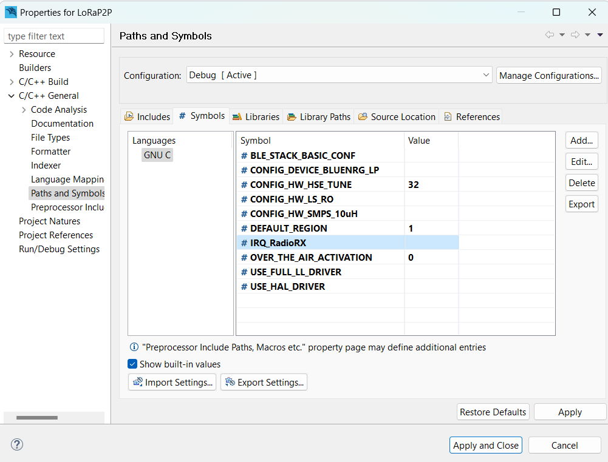

# Lora P2P 

In this example, LoRa is used for peer-to-peer communication between devices. The CAD (channel activity detection) is opened, one node sends a PING, and if the other node receives the message, it sends a PONG back.

The firmware configures some necessary peripherals, like USART1 (log purposes), GPIOs (radio interruption, etc.) and I2C (STsafe).

## SDK Version
This example is compatible with version 1.1.0. 

## Test Setup

This section describes the basic test setup to running this application.

* [Git](https://git-scm.com/downloads).
* [RF-Flasher Utility](https://www.st.com/en/embedded-software/stsw-bnrgflasher.html).
* [WiSE-Studio IDE](https://www.st.com/en/embedded-software/stsw-wise-studio.html).
* RS232 terminal ([Termite](https://www.compuphase.com/software_termite.htm) is recommended).
* [ST-Link Debugger](https://www.st.com/en/development-tools/st-link-v2.html) to flash a firmware.
* [GATTbrowser android app](https://play.google.com/store/apps/details?id=com.renesas.ble.gattbrowser).
* EVB - HTLRBL32.
* FTDI (usb-serial converter – one for each device).

# Executing																					  

1. Clone the examples/SDK branch: <br/>

```
git clone --single-branch --branch master https://github.com/Hana-Electronics/EVB-LoRaWAN-HTLRBL32L.git
```

2. Open WiSE-Studio IDE. 
3. Click in "File->Open Projects from File System...": <br/>

 


4. Click in "Directory...", find and select your cloned folder "LoRaWAN Base" then click "Finish" to open project. <br/>


5. Right click the project in the project explorer, click on 'Properties', go to 'C/C++ General', then 'Paths and Symbols', add a symbol called 'USE_LORA'. Apply and Close. 


6. Right click the project in the project explorer, then click "Run As...-> Wise C/C++ Application" to build and flash the new firmware into your device: <br/>


7. Open Termite and reset your device to check if the initial string was printed on serial. <br/>


## Extra Documentation

Datasheets and application notes can be found at [HTLRBL32 Repository](https://github.com/htmicron/htlrbl32l).

## References

For additional information:

* [HTLRBL32 datasheet](https://www.st.com/resource/en/datasheet/hts221.pdf).
* [Semtech SX1308 LoRa® Gateway datasheet](https://www.mouser.com/datasheet/2/761/sx1308-1277867.pdf).


## Contact Information

Head Office – São Leopoldo, RS <br/>
HT Micron Semiconductors <br/>
Unisinos Avenue, 1550 <br/>
São Leopoldo - RS <br/>
ZIP 93022-750 <br/>
Brazil <br/>
Tel: +55 51 3081-8650 <br/>
E-mail (Support): support_iot@htmicron.com.br <br/>
E-mail (General Enquiries): htmicron@htmicron.com.b <br/>
